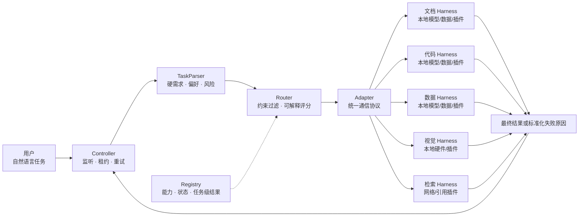

# FedHarness：本地异构 Harness 路由与自进化实验平台

> 当前版本：v0.5-local。默认在一台用户电脑上运行，不需要 ECS、Docker、KVM 或 CubeSandbox。

FedHarness 研究如何在多个动态加入、性能未知、内部不可见的异构 Harness 之间自动分配任务。每个 Harness 可以整合不同硬件、本地模型、本地数据、插件和内部 Agent Team；Controller 不读取内部 Agent、思维链或执行轨迹，只使用能力声明、在线状态和任务级结果进行路由与学习。

当前仓库提供一个可本地运行的确定性基线：可解释 TaskParser、约束优先 Router、动态 Registry、前后台准入、故障重试，以及五个能力不同的本地 Harness。未来的世界模型将复用同一个输入输出接口替换当前评分器。

## 一张图理解系统



全局系统只选择 Harness。Harness 内部使用一个 Agent、多个 Agent，还是动态组成 Agent Team，由 Harness 自己决定。

## 五分钟本地运行

要求：Python 3.10 或更高版本。基础演示只使用 Python 标准库。

### 1. 零依赖冒烟测试

```bash
git clone https://github.com/ahuidffwkjf/heterogeneous-agent-routing.git
cd heterogeneous-agent-routing
python3 local_runtime.py --engine mock --smoke-test
```

该命令会在 `127.0.0.1:8081` 启动 Controller 和五个本地 Harness，自动提交一项 Python 测试任务，等待 Router 选择 Harness，打印执行结果后退出。

### 2. 保持本地服务运行

```bash
python3 local_runtime.py --engine mock
```

另开一个终端提交任务：

```bash
curl -X POST http://127.0.0.1:8081/tasks \
  -H 'Content-Type: application/json' \
  -d '{
    "task_id": "local-code-001",
    "description": "运行 Python 单元测试"
  }'
```

使用返回的 `job_id` 查询结果：

```bash
curl http://127.0.0.1:8081/tasks/<job_id>
```

按 `Control-C` 停止 Controller 和全部本地 Harness。运行状态写入 `.local_runtime/`，不会提交到 Git。

### 3. 调用真实的本机 DSH

先按照 DSH 的安装方式完成配置，并确认：

```bash
dsh --version
```

如果使用 DeepSeek 官方模型路由，请在启动终端中配置凭证，或使用 DSH 自己的凭证服务。不要把 Key 写入仓库。

```bash
export DEEPSEEK_API_KEY="你的真实Key"
python3 local_runtime.py --engine host
```

`host` 模式会调用本机：

```text
dsh --profile headless "经过黑箱边界和失败报告规则增强后的任务 Prompt"
```

每个 Harness 使用 `.local_runtime/workspaces/<harness_id>/` 作为独立工作目录。这是进程和目录级隔离，不是硬件级安全边界；不要把不可信任务直接交给 `host` 模式。

## 本地 Harness 配置

[`execution_units_local.json`](execution_units_local.json) 默认声明五个黑箱 Harness：

| Harness | 对外能力 | 示例插件 |
|---|---|---|
| `local_docs_harness` | 文档、本地文件、数据本地性 | file、document |
| `local_code_harness` | Python、Shell、构建、测试 | python、shell、test |
| `local_data_harness` | 数据处理、结构化抽取、SQLite | data、structured-output |
| `local_vision_harness` | 摄像头、图像推理 | vision、image |
| `local_research_harness` | 网络检索、引用、文档 | web、citation |

启动时 Adapter 会自动上报本机平台、CPU 核数和架构。静态配置制造能力差异，动态注册信息反映真实本地环境。

## 路由逻辑

当前实现不是已经训练好的世界模型，而是论文实验所需的可复现规则基线：

```text
任务描述
  → 需求解析
  → 硬约束过滤
  → 成功率/质量/延迟/成本/负载评分
  → 选择 Harness
  → 只观察最终结果与失败原因
```

### 更完整的判断规则

TaskParser 现在会识别：

- 必需能力、偏好能力、工具和平台；
- GPU、移动设备、网络和数据本地性；
- 并行性、隐私级别和任务风险；
- 低延迟、低成本、高质量和高成功率目标；
- “无需 GPU”“不要联网”等否定表达；
- 摄像头能力与 iOS 平台的区别；
- GPU 硬约束与 GPU 偏好的区别；
- 每一项推断的理由和冲突警告。

查看一项任务会被怎样解析：

```bash
python3 router.py --explain-task "紧急处理不能上传的医疗数据，不需要 GPU"
```

解析政策定义在 [`router.py`](router.py) 的 `ROUTING_POLICY_PROMPT`。它同时是未来蒸馏世界模型需要遵守的结构化输出契约。

任务结果中会保存：

- `inferred_requirements`：解析后的约束、偏好和理由；
- `routing_decision`：候选排名、评分分解和被拒绝 Harness 的原因；
- `result`：成功、质量、延迟、成本或标准化失败原因。

用户不能通过任务请求指定 `harness_id`、`selected_unit`、`agent_id` 或 `agent_team_id`。

## 黑箱边界

Controller 可以获得：

- Harness 的能力、工具、平台和粗粒度硬件声明；
- 在线、忙碌、退化状态和当前负载；
- 任务是否成功、总延迟、成本、质量和失败类型。

Controller 不要求获得：

- Harness 内部 Agent 或 Agent Team 拓扑；
- 内部消息、思维链和完整工具调用轨迹；
- 本地模型参数、私有数据和插件实现。

[`dsh_agent.py`](dsh_agent.py) 会给本机 DSH 加入明确的黑箱执行 Prompt：内部可以自主协作，但成功时必须给出可验证产物，失败时必须报告失败类型、阶段、直接原因和可重试性。

## 新 Harness 的后台准入

未知 Harness 不会直接处理用户任务：

```text
新 Harness 注册
  → testing / background-only
  → 执行 Canary Probe
  → 只回传任务级指标
  → 达到阈值后进入 foreground
```

前台任务和后台测试使用不同队列。Harness 新发现的内部 Agent 也先在后台验证，其能力通过后只汇总到父 Harness；内部 Agent 不会成为全局路由单元。

## 本地模式与可选沙箱后端

| 模式 | 是否需要 ECS | 执行位置 | 用途 |
|---|---:|---|---|
| `local_runtime.py --engine mock` | 否 | 本地模拟执行 | 零依赖功能验证、路由实验 |
| `local_runtime.py --engine host` | 否 | 本机 DSH 进程 | 真实本地任务与数据采集 |
| `controller.py --microvm-backend mock` | 否 | 自行启动 Adapter | 控制面和池语义实验 |
| `controller.py --microvm-backend cubesandbox` | 可选 | CubeSandbox MicroVM | 隔离和云端扩展实验 |

ECS/CubeSandbox 不再是系统成立的前提，只是可插拔执行后端。历史实机实验记录保留在 [`文章/phase1_dsh_cubesandbox_experiment.md`](文章/phase1_dsh_cubesandbox_experiment.md)。

## 从规则基线到本地世界模型

世界模型面对的是黑箱 Harness，因此不依赖内部轨迹。它学习任务与外部状态到结果的映射：

\[
P(quality, latency, cost, failure \mid task, harness, observable\ state)
\]

下一阶段计划：

1. 从本地 Registry 导出不含内部轨迹的任务级样本；
2. 建立历史均值、Contextual Bandit 和 Monte Carlo Rollout 基线；
3. 训练轻量结果预测模型，并通过与 TaskParser 相同的 Schema 接入 Router；
4. 比较规则、在线统计和世界模型在负载波动、掉线和新 Harness 加入时的 regret；
5. 让模型同时决定“测试谁、测试什么、何时停止测试”；
6. 对高风险任务研究主/副 Harness Team 和快速接管。

这样，本地电脑即可完成算法、消融、故障注入和小规模世界模型实验；只有验证真实硬件隔离或跨物理节点时才需要额外基础设施。

## 主要文件

| 文件 | 作用 |
|---|---|
| `local_runtime.py` | 一条命令启动本地 Controller 与多个 Harness |
| `controller.py` | 任务 API、租约、准入、心跳、重试与结果管理 |
| `router.py` | 可解释 TaskParser、路由政策 Prompt、约束与评分 |
| `registry.py` | SQLite Registry 与任务状态 |
| `dsh_agent.py` | 本地 DSH/mock/Cube Adapter 与黑箱执行 Prompt |
| `execution_units_local.json` | 五个本地异构 Harness 配置 |
| `microvm_pool.py` | 可选的 Mock/CubeSandbox 池后端 |
| `archive/early_mac_iphone/` | 早期 Mac/iPhone 概念验证 |
| `文章/current_system_research_report.md` | 阶段性研究报告 |

## 测试

```bash
python3 -m unittest -v
python3 local_runtime.py --engine mock --smoke-test
```

测试覆盖需求解析、否定规则、硬约束、动态注册、后台准入、故障重试、租约、逻辑沙箱池和本地端到端执行。

## 安全说明

- Controller 默认只监听 `127.0.0.1`；不要无认证暴露到公网。
- Registry Token 和运行状态保存在被忽略的 `.local_runtime/`。
- API Key 只通过环境变量或 DSH 凭证服务提供，不写入任务、配置或日志。
- `mock` 和 `host` 模式不是 MicroVM 安全沙箱；处理不可信代码时应接入真正的隔离后端。
- 本项目不收集 Harness 内部思维链、私有数据或完整执行轨迹。

## License

[MIT License](LICENSE)
