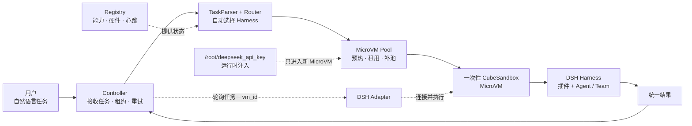

# 异构 Agent Router：DeepSeek Harness + MicroVM

> 当前版本：控制面原型 v0.3（DSH Harness、MicroVM Pool、前后台测试隔离与故障恢复）

这是一个面向异构 Agent Harness 的实验原型。用户只提交自然语言任务，系统自动完成 Harness 选择、MicroVM 分配、执行和故障恢复。

当前实验统一使用 DeepSeek Harness（DSH），通过不同插件、工具和硬件配置制造 Harness 能力差异。Harness 内部如何发现 Agent、是否组建 Agent Team 以及如何协作，对全局 Router 和用户都是隐藏的。

## 当前结构



一句话理解：Router 只负责选 Harness，Controller 负责协调，MicroVM Pool 负责隔离环境，Harness 负责内部协作。

主目录只保留当前 DSH + MicroVM 主线。Mac/iPhone 是早期概念验证，已单独放入 [`archive/early_mac_iphone/`](archive/early_mac_iphone/)，实验过程见 [`reports/early_mac_iphone_experiment.md`](reports/early_mac_iphone_experiment.md)。

完整的生命周期说明见 [`docs/architecture_v2.md`](docs/architecture_v2.md)。

## 核心流程

```text
POST /tasks
  → TaskParser 推断能力、工具、平台和资源需求
  → Router 读取 Registry，过滤不满足硬约束的 Harness
  → Controller 创建任务租约并从 MicroVM Pool 租用沙箱
  → DSH Adapter 轮询任务，在 MicroVM 内运行 DSH
  → Harness 自己发现 Agent / Agent Team 并完成内部协作
  → 回传统一结果
  → Controller 销毁任务 MicroVM，并补充预热池
```

用户不能在任务请求中指定 `harness_id`、`selected_unit` 或 `agent_id`。执行单元由 Router 根据任务需求、硬件、工具、负载和在线状态自动选择。

## 主要文件

| 文件 | 作用 |
|---|---|
| `controller.py` | Controller、任务 API、注册 API、心跳监视和故障恢复 |
| `router.py` | TaskParser、硬约束过滤和执行单元评分 |
| `registry.py` | SQLite Registry 和 Job Store |
| `microvm_pool.py` | MicroVM 预热、租用、销毁、补池、快照语义，以及 Mock/CubeSandbox Backend |
| `microvm_nodes.json` | 逻辑节点、资源容量和运行时版本配置 |
| `dsh_agent.py` | DSH Harness 的注册、心跳、轮询和执行适配器 |
| `execution_units_dsh.json` | DSH Harness 能力、插件和 MicroVM Profile |
| `test_router.py` | 路由和需求解析测试 |
| `test_reliability.py` | 心跳、掉线、租约和重试测试 |
| `test_microvm_pool.py` | Mock MicroVM 池、节点和快照测试 |
| `test_cube_sandbox_backend.py` | CubeSandbox Backend 的 SDK 调用、销毁和补池测试 |
| `test_execution_units.json` | 测试专用的最小执行单元配置 |
| `archive/early_mac_iphone/` | 早期 Mac/iPhone 原型归档 |
| `reports/early_mac_iphone_experiment.md` | 早期实验报告 |
| `文章/phase1_dsh_cubesandbox_experiment.md` | 当前 ECS + DSH + CubeSandbox 第一阶段实验报告 |

运行后生成的 `registry.db`、令牌、日志和 MicroVM 快照不会提交到 Git。

## 本地 / ECS 启动

### 1. 准备配置

当前配置中的三个执行单元都是统一的 DeepSeek Harness，只通过插件和能力产生差异：

```text
dsh_harness_01 → 文件、文档、Python
dsh_harness_02 → Shell、Python、代码构建
dsh_harness_03 → 数据处理、结构化抽取、Python
```

在 ECS 项目目录中：

```bash
cd /opt/heterogeneous-agents
export REGISTRY_TOKEN="$(cat /root/registry_token)"
```

### 2. 启动 Controller

```bash
python3 -u controller.py \
  --host 0.0.0.0 \
  --port 8081 \
  --registry execution_units_dsh.json \
  --database registry.db \
  --registry-token "$REGISTRY_TOKEN" \
  --microvm-pool-size 3 \
  --microvm-max-total 8 \
  --microvm-nodes microvm_nodes.json \
  --microvm-snapshot-dir /opt/heterogeneous-agents/microvm_snapshots \
  --probe-successes-required 1 \
  --probe-max-attempts 3
```

检查服务：

```bash
curl http://127.0.0.1:8081/health
curl -H "X-Registry-Token: $REGISTRY_TOKEN" \
  http://127.0.0.1:8081/registry/units
curl -H "X-Registry-Token: $REGISTRY_TOKEN" \
  http://127.0.0.1:8081/microvms
```

### 3. 启动 DSH Adapter

每个 Harness 应在自己的 MicroVM 中运行一个 Adapter。下面是文件/文档 Harness 的示例：

```bash
python3 dsh_agent.py \
  --controller-url http://CONTROLLER_IP:8081 \
  --registry-token "$REGISTRY_TOKEN" \
  --unit-id dsh_harness_01 \
  --profile headless \
  --capability local_file_access \
  --capability document_generation \
  --capability python \
  --tool dsh \
  --tool python \
  --plugin file \
  --plugin document \
  --workspace /workspace
```

Adapter 使用 DSH 官方 headless 调用形式：

```bash
dsh --profile headless "任务描述"
```

如果要模拟三个 Harness，可以分别启动三个 Adapter，并使用各自的 `--unit-id`、能力和插件参数。默认 `microvm_pool.py` 使用 `MockMicroVMBackend`，本地测试不会创建真实虚拟机。

在 ECS 上切换到真实 CubeSandbox Backend 时，Adapter 可以使用任务中 Controller 传来的 `microvm_id` 连接到对应的 CubeSandbox。`--execution-mode cube` 会在该任务 MicroVM 内运行 DSH；前提是对应的 READY 模板中已经安装 `dsh` 及其插件。

### ECS 上启用真实 CubeSandbox Backend

先确认 ECS 上 CubeSandbox、PVM 和模板已经 READY，然后设置模板 ID：

```bash
export CUBE_API_URL="http://127.0.0.1:3000"
export CUBE_API_KEY="e2b_000000"
export CUBE_PROXY_NODE_IP="127.0.0.1"
export CUBE_PROXY_PORT_HTTP=80
export CUBE_TEMPLATE_ID="tpl-你的READY模板ID"

# 不把 DeepSeek Key 写入任务、Registry 或模板；仅保存到 Controller 主机
read -s DEEPSEEK_API_KEY
printf '\n'
printf '%s' "$DEEPSEEK_API_KEY" > /root/deepseek_api_key
chmod 600 /root/deepseek_api_key
unset DEEPSEEK_API_KEY
```

启动 Controller 时显式指定真实 Backend：

```bash
python3 -u controller.py \
  --host 0.0.0.0 \
  --port 8081 \
  --registry execution_units_dsh.json \
  --database registry.db \
  --registry-token "$REGISTRY_TOKEN" \
  --microvm-backend cubesandbox \
  --cube-api-url "$CUBE_API_URL" \
  --cube-api-key "$CUBE_API_KEY" \
  --cube-proxy-node-ip "$CUBE_PROXY_NODE_IP" \
  --cube-proxy-port-http "$CUBE_PROXY_PORT_HTTP" \
  --cube-template-id "$CUBE_TEMPLATE_ID" \
  --dsh-api-key-file /root/deepseek_api_key \
  --dsh-permission-mode danger-full-access \
  --microvm-pool-size 1 \
  --microvm-max-total 2
```

`--dsh-api-key-file` 只在 Controller 创建 CubeSandbox 时读取，并通过
`env_vars` 注入新 MicroVM；任务请求、Harness 注册信息和日志不会携带 API Key。
`danger-full-access` 只关闭 DSH 在 MicroVM 内部的第二层本地沙箱，外层
CubeSandbox MicroVM 仍然是实际的隔离边界。

当前注册表有 3 个 Harness Profile，因此 `--microvm-pool-size 1` 会为每个已启用的 Profile 预热 1 个 Sandbox。第一次联调建议先使用 1 个 Profile，避免一次性创建过多真实 Sandbox。

检查真实 VM ID：

```bash
curl -H "X-Registry-Token: $REGISTRY_TOKEN" \
  http://127.0.0.1:8081/microvms
```

返回的 `vm_id` 应是 CubeSandbox 的 Sandbox ID，而不是 `mock-vm-*`。

启动使用真实 CubeSandbox 执行面的 Adapter：

```bash
python3 dsh_agent.py \
  --controller-url http://127.0.0.1:8081 \
  --registry-token "$REGISTRY_TOKEN" \
  --unit-id dsh_harness_01 \
  --profile headless \
  --execution-mode cube \
  --cube-api-url "$CUBE_API_URL" \
  --cube-api-key "$CUBE_API_KEY" \
  --cube-proxy-node-ip "$CUBE_PROXY_NODE_IP" \
  --cube-proxy-port-http "$CUBE_PROXY_PORT_HTTP" \
  --capability local_file_access \
  --capability document_generation \
  --capability python \
  --tool dsh \
  --tool python \
  --plugin file \
  --plugin document \
  --workspace /workspace
```

如果返回 `dsh_not_installed` 或 `dsh_execution_failed`，说明 CubeSandbox 本身正常，但当前模板还没有安装 DSH 或对应插件，需要重新制作一个包含 DSH Harness 的 READY 模板。

新加入且不在初始配置中的 Adapter 会自动进入后台测试模式。Adapter 会从 `/background/tasks/next` 拉取 Canary Task；测试成功后，Controller 才会把它切换为前台可调度状态。

Harness 在运行过程中发现新的内部 Agent 时，不能直接把它加入全局路由。应由 Harness 向 Controller 报告一个候选摘要：

```bash
curl -X POST http://127.0.0.1:8081/harness/discover \
  -H 'Content-Type: application/json' \
  -H "X-Registry-Token: $REGISTRY_TOKEN" \
  -d '{
    "harness_id": "dsh_harness_01",
    "agents": [{
      "agent_id": "vision-agent-01",
      "platforms": ["linux"],
      "capabilities": ["image_inference"],
      "tools": ["python"],
      "hardware": {"gpu": true},
      "probe_task": "验证新发现 Agent 能完成一项图像推理任务"
    }]
  }'
```

Controller 处理流程为：

```text
Harness 发现 Agent
    ↓
候选状态 testing / background-only
    ↓
父 Harness 从 /background/tasks/next 获取 Canary Task
    ↓
成功：候选变为 eligible，能力汇总到父 Harness 的前台能力
失败：继续测试，或标记 rejected
    ↓
Router 才能选择具备新能力的父 Harness
```

Agent 的内部身份不会暴露给全局 Router；Router 仍然只选择 Harness。已进入前台的 Harness 也会继续轮询后台发现测试，因此后台验证不会阻塞已有的前台任务。

## 自动路由示例

任务只填写描述，不填写执行单元：

```bash
curl -X POST http://127.0.0.1:8081/tasks \
  -H 'Content-Type: application/json' \
  -d '{
    "task_id": "dsh-file-001",
    "description": "读取输入文件并生成一份报告",
    "input_path": "/workspace/input.txt"
  }'
```

Controller 返回 `job_id` 和 Router 的选择结果。查询任务：

```bash
curl http://127.0.0.1:8081/tasks/<job_id>
```

执行单元也可以运行期间动态注册：

```bash
curl -X POST http://127.0.0.1:8081/registry/register \
  -H 'Content-Type: application/json' \
  -H "X-Registry-Token: $REGISTRY_TOKEN" \
  -d '{
    "unit_id": "new_dsh_harness_01",
    "unit_type": "harness",
    "platforms": ["linux"],
    "capabilities": ["python", "parallel_compute"],
    "tools": ["dsh", "python"],
    "state": "idle",
    "load": 0.0,
    "metadata": {
      "harness_type": "deepseek",
      "probe_task": "运行一个短时能力验证任务并返回成功、延迟和错误信息",
      "sandbox": {"type": "microvm", "profile": "dsh-linux"},
      "hardware": {"architecture": "x86_64", "cpu_cores": 8, "memory_gb": 16, "gpu": false}
    },
    "heartbeat_required": true
  }'
```

## 前台调度与后台测试隔离

新 Harness 不会刚注册就抢占用户任务。Controller 将它放入独立的后台测试通道：

```text
新 Harness 注册
    ↓
testing / background-only
    ↓
后台 Canary Task
    ↓
记录成功率、延迟、错误和心跳
    ↓
达到阈值 → idle / foreground
未达到阈值 → 继续测试或 degraded / background-only
```

两条队列完全分离：

| 通道 | 任务来源 | 可调度对象 | 目的 |
|---|---|---|---|
| 前台队列 | 用户 `/tasks` | 已验证的 Harness | 尽快完成用户任务 |
| 后台队列 | Controller Probe Scheduler | 新注册或待验证 Harness | 获取能力证据、更新可信度 |

注册时不填写 `registration_mode`，默认进入后台测试。只有初始配置中的已知 Harness，或明确使用 `registration_mode: "trusted"` 的执行单元，才会直接进入前台。

后台测试结果会写入 Registry 的 `probe_count`、`probe_successes`、`probe_failures`、`confidence` 和 `probe_history` 字段。默认一次成功的 Canary Task 即可晋升；正式实验可以通过 `--probe-successes-required` 提高门槛。

Adapter 的后台流程是：

```text
注册 → 收到 testing 状态
     → GET /background/tasks/next
     → 执行 Canary Task
     → POST /background/tasks/<probe_id>/result
     → 收到 eligible/idle 状态
     → 切换到 GET /tasks/next
```

## MicroVM Pool 语义

池采用任务级一次性沙箱：

```text
启动 Controller → 预热 3 个 READY MicroVM
任务选中 Harness → 租用 1 个 MicroVM
租用后立即创建新 MicroVM 补足 READY 余额
任务成功或失败 → 销毁本次任务 MicroVM
```

任务沙箱不归还，避免文件、进程、凭证和网络状态泄漏。池还支持以下控制面语义：

- 根据节点状态、CPU、内存和运行时版本选择节点；
- 隔离或排空节点，阻止新任务进入故障节点；
- 将 pause 快照写入共享目录，并在兼容节点恢复；
- 通过运行时版本检查保证旧快照不会被不兼容组件恢复。

`microvm_nodes.json` 中的 Node A / Node B 目前是同一台 ECS 上的逻辑节点，只能验证调度和状态语义，不能作为多物理机性能结果。真实跨主机恢复还需要接入 KVM、Firecracker 或 CubeSandbox，以及 S3/MinIO 等共享存储。

节点运维接口示例：

```bash
curl -H "X-Registry-Token: $REGISTRY_TOKEN" \
  http://127.0.0.1:8081/ops/nodes

curl -X POST -H "X-Registry-Token: $REGISTRY_TOKEN" \
  http://127.0.0.1:8081/ops/nodes/node-ecs-01/isolate

curl -X POST -H "X-Registry-Token: $REGISTRY_TOKEN" \
  http://127.0.0.1:8081/ops/nodes/node-ecs-01/restore
```

## 掉线与恢复

Controller 保存每次分配的 `lease_id`、`attempt` 和失败历史：

```text
Harness 停止心跳
  → Controller 标记 offline
  → 任务进入 retry_wait
  → Router 排除故障 Harness
  → 重新选择在线 Harness
  → 创建新的租约和 MicroVM
```

旧 Harness 恢复后提交旧租约结果时，Controller 会拒绝该结果，不能覆盖新 attempt。

## 测试

```bash
python3 -m unittest -v \
  test_router.py \
  test_reliability.py \
  test_microvm_pool.py
```

测试覆盖任务需求解析、硬约束路由、动态注册、心跳与掉线、任务重试、旧租约拒绝、Controller 重启恢复、MicroVM 预热/销毁/补池以及逻辑跨节点快照恢复。

## 研究路线

当前工程顺序为：

1. 用 Mock Backend 完成 Router、Controller、Registry 和 MicroVM Pool 的协调验证；
2. 在 ECS 上运行统一 DSH Harness，并用插件制造能力差异；
3. 在 ECS 上切换到 CubeSandbox Backend，并验证真实 Sandbox 的创建、销毁和补池；
4. 通过蒸馏将 World Model 的预测能力整合进 TaskParser，让系统自主组建 Agent Team，并在失败时返回结构化失败原因；
5. 使用一致性哈希为主 Agent Team 建立副 Agent Team，将必要数据和上下文同步到副本，支持主 Team 失败后的快速接管；
6. 使用脱敏 Trace Replay、合成 Canary 和真实 Shadow Task 加速新 Agent 的后台准入；
7. 在多节点和故障注入场景下进行正式对比实验。

## 当前版本边界

当前版本默认仍使用 Mock Backend 以保持本地测试快速稳定；ECS 启动时可以用 `--microvm-backend cubesandbox` 接入真实 CubeSandbox。共享对象存储、跨物理节点恢复和 World Model 预测仍属于后续实验阶段。
