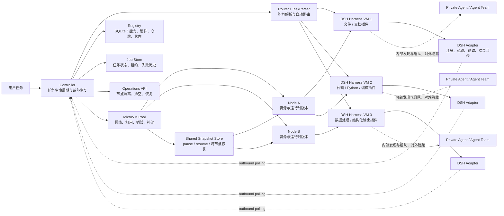

# 异构 Agent Router：DeepSeek Harness + MicroVM

这是一个面向异构 Agent Harness 的实验原型。当前主线是：在 ECS 上运行 Controller、Router、Registry 和 MicroVM Pool，在每个隔离执行环境内运行统一的 DeepSeek Harness，并通过插件、权限、数据位置和资源状态形成能力差异。

系统由 Controller、TaskRouter、动态 Harness Registry、DSH Adapter、Harness Runtime 和 MicroVM Warm Pool 组成。全局 Router 根据任务语义、能力、工具、硬件和在线状态选择 Harness；Harness 自己发现内部 Agent，并按任务需求组建 Agent Team。用户和全局 Router 不需要知道 Team 内部如何分工。

## 项目结构图



当前研究边界是：全局 Router 只选择 DSH Harness 实例，不直接选择 Harness 内部 Agent；MicroVM Pool 负责隔离和生命周期，DSH 负责 Harness 内部工具、插件和 Agent 协作。

## 当前架构

```text
用户任务
   ↓
Controller
   ├── SQLite Registry：Agent 注册、硬件和心跳
   ├── Job Store：任务状态和失败历史
   ├── TaskRouter：任务解析与执行单元选择
   ├── DSH Adapter：统一 DeepSeek Harness 的注册、轮询和执行
   └── MicroVMPool：按 Harness Profile 管理预热 MicroVM
           ↓
    DSH Harness + Plugins
           ↓
    Harness 内部发现 Agent / Agent Team
```

Controller 负责监听、调度、心跳检测和故障恢复；Router 只负责分析任务并选择 Harness；Harness Runtime 负责内部 Agent 发现、组队和协作。

## Harness 内部自治

全局 Router 只看到 Harness 的聚合能力：

```text
Hardware Node
└── Harness
    ├── Agent A
    ├── Agent B
    └── Agent Team
        ├── Agent C
        └── Agent D
```

任务到达 Harness 后，Harness 自己完成：

```text
发现内部 Agent
→ 判断单 Agent 是否足够
→ 必要时组建 Agent Team
→ 决定并行、顺序和通信方式
→ 执行并聚合结果
→ 向 Controller 返回统一结果
```

内部成员信息不会通过公共 Registry API 返回给用户，但 Harness 可以保留内部轨迹用于调试、故障恢复和 World Model 训练。

## 主要文件

| 文件 | 作用 |
|---|---|
| `phase1_mac_iphone.py` | Controller、任务 API、Registry API 和故障恢复 |
| `router.py` | 自然语言任务解析和执行单元路由 |
| `registry.py` | SQLite 动态 Agent Registry 和 Job Store |
| `microvm_pool.py` | MicroVM 预热池、租用、销毁和补充 |
| `microvm_nodes.json` | 多节点、运行时版本和资源容量的实验配置 |
| `dsh_agent.py` | 在 MicroVM 内运行的 DeepSeek Harness 轮询适配器 |
| `execution_units_dsh.json` | DSH Harness 实验执行单元配置 |
| `harness_runtime.py` | Harness 内部 Agent 发现和 Agent Team 组建 |
| `mac_agent.py` | Mac HTTP Agent |
| `execution_units.json` | 初始执行单元配置 |
| `MobileAgent/.../ContentView.swift` | iPhone 注册、心跳、轮询和结果回传 |

运行时会生成 `registry.db`，其中保存执行单元和任务状态。

## CubeSandbox 风格的 MicroVM 生命周期

当前 `microvm_pool.py` 已经按 CubeSandbox v0.7.0 的关键控制面逻辑实现了一个本地可重放版本。默认仍使用 `MockMicroVMBackend`，因此不会假装已经接入真实 KVM；以后只需要替换 Backend，即可对接 Firecracker、CubeSandbox 或其他 MicroVM 服务。

目前支持：

- **节点感知分配**：根据节点状态、CPU、内存和运行时版本选择低负载节点；
- **节点隔离与排空**：`isolated` 节点不再接收新沙箱，`draining` 节点用于节点下线实验；
- **共享快照存储**：pause 后把内存、文件系统、网络状态写入共享快照目录；
- **跨节点恢复**：同一个快照可以在兼容的其他节点上 resume，或创建新的 MicroVM；
- **组件多版本共存**：快照携带 `runtime_version`，恢复时检查目标节点是否支持该版本；
- **任务沙箱一次性生命周期**：任务成功或失败后销毁 MicroVM，并自动补充预热实例；
- **控制面/运维接口分离**：任务仍由 Controller/Router 管理，节点和沙箱运维使用 `/ops/*` 接口。

`microvm_nodes.json` 中的多个节点目前是同一台 ECS 上的逻辑节点，只用于验证调度、隔离、快照和恢复语义，不能当作多台物理机器的性能结果。真实跨主机迁移需要将 Backend 和快照存储替换为 KVM + CubeSandbox/Firecracker + S3/MinIO。

启动多节点模拟实验：

```bash
python3 phase1_mac_iphone.py \
  --host 0.0.0.0 \
  --port 8081 \
  --registry execution_units.json \
  --database registry.db \
  --registry-token "$REGISTRY_TOKEN" \
  --microvm-pool-size 3 \
  --microvm-max-total 8 \
  --microvm-nodes microvm_nodes.json \
  --microvm-snapshot-dir /opt/heterogeneous-agents/microvm_snapshots
```

查看节点和 MicroVM：

```bash
curl -H "X-Registry-Token: $REGISTRY_TOKEN" \
  http://127.0.0.1:8081/ops/nodes

curl -H "X-Registry-Token: $REGISTRY_TOKEN" \
  http://127.0.0.1:8081/microvms
```

节点运维操作：

```bash
# 隔离节点：不再为新任务创建 MicroVM
curl -X POST -H "X-Registry-Token: $REGISTRY_TOKEN" \
  http://127.0.0.1:8081/ops/nodes/node-ecs-01/isolate

# 排空节点：用于模拟节点下线
curl -X POST -H "X-Registry-Token: $REGISTRY_TOKEN" \
  http://127.0.0.1:8081/ops/nodes/node-ecs-01/drain

# 恢复节点参与调度
curl -X POST -H "X-Registry-Token: $REGISTRY_TOKEN" \
  http://127.0.0.1:8081/ops/nodes/node-ecs-01/restore
```

当前仍未实现真实内存页、磁盘块和 TAP 网络设备的迁移；这些属于后续 KVM/CubeSandbox Backend 的职责。

## ECS 上的 DSH MicroVM 实验

当前实验使用三个统一的 DeepSeek Harness 执行单元。它们不是三种不同 Harness，而是同一 DSH 运行时的不同插件/能力配置：

```text
dsh_harness_01 → 文件、文档、Python
dsh_harness_02 → Shell、Python、代码构建
dsh_harness_03 → 数据处理、结构化抽取、Python
```

使用 DSH 配置启动 Controller：

```bash
python3 -u phase1_mac_iphone.py \
  --host 0.0.0.0 \
  --port 8081 \
  --registry execution_units_dsh.json \
  --database registry.db \
  --registry-token "$REGISTRY_TOKEN" \
  --microvm-pool-size 3 \
  --microvm-max-total 8 \
  --microvm-nodes microvm_nodes.json \
  --microvm-snapshot-dir /opt/heterogeneous-agents/microvm_snapshots
```

每个 DSH Harness 进程应在自己的 MicroVM 内运行：

```bash
python3 dsh_agent.py \
  --controller-url http://CONTROLLER_IP:8081 \
  --registry-token "$REGISTRY_TOKEN" \
  --unit-id dsh_harness_01 \
  --profile headless \
  --capability local_file_access \
  --capability document_generation \
  --capability python \
  --tool dsh \
  --tool python \
  --plugin file \
  --plugin document \
  --workspace /workspace
```

`dsh_agent.py` 只向 Controller 暴露 Harness 的聚合能力，不暴露 DSH 内部 Agent 和 Agent Team。当前默认 Backend 仍是 Mock；确认 ECS 存在 `/dev/kvm` 后，再接入真实 CubeSandbox/Firecracker Backend。

## 启动 Controller

在项目目录执行：

```bash
cd "/Users/reveriephobia/Desktop/异构多智能体"

python3 phase1_mac_iphone.py \
  --host 0.0.0.0 \
  --port 8081 \
  --registry-token dev-token \
  --microvm-pool-size 3 \
  --microvm-max-total 8
```

参数说明：

- `--registry-token`：Agent 注册和心跳所需的令牌；不要在真实网络中使用公开的简单令牌。
- `--microvm-pool-size`：每种 MicroVM Profile 保持的预热实例数量，默认 3。
- `--microvm-max-total`：高并发时某个 Profile 的最大实例数量，默认 8。
- `--heartbeat-timeout`：心跳超时时间，默认 15 秒。
- `--max-retries`：任务默认最大重试次数，默认 2 次。

## 启动 Mac Agent

Mac Agent 需要向 Controller 注册并发送心跳：

```bash
python3 mac_agent.py \
  --host 127.0.0.1 \
  --port 9001 \
  --controller-url http://127.0.0.1:8081 \
  --registry-token dev-token
```

如果 Controller 和 Mac Agent 不在同一台机器上，把 `--controller-url` 改成 Controller 的局域网地址。

## 启动 iPhone Agent

在 Xcode 中打开：

```text
MobileAgent/MobileAgent.xcodeproj
```

在 App 中填写：

```text
Controller 地址：http://你的Mac局域网IP:8081
Registry Token：dev-token
```

然后点击“开始轮询”。iPhone App 会执行以下操作：

1. 注册 `iphone_agent_01`；
2. 每 5 秒发送一次心跳；
3. 轮询新的移动端任务；
4. 完成任务后携带 `lease_id` 回传结果。

## 自动任务路由

用户只提交任务描述，不需要指定 Agent：

用户也不能在请求中指定 `harness_id`、`selected_unit` 或 `agent_id`。这些字段会被 Controller 拒绝。Harness 只能由 Router 根据任务需求、硬件能力、负载和健康状态自动选择。

```bash
curl -X POST http://127.0.0.1:8081/tasks \
  -H 'Content-Type: application/json' \
  -d '{
    "task_id": "auto-mac-001",
    "description": "读取本地文件并生成一份报告",
    "input_path": "data/sample_input.txt"
  }'
```

Router 会推断：

```text
local_file_access + document_generation
→ mac_agent_01
```

移动端任务示例：

```bash
curl -X POST http://127.0.0.1:8081/tasks \
  -H 'Content-Type: application/json' \
  -d '{
    "task_id": "iphone-001",
    "description": "用手机拍一张照片",
    "max_retries": 2
  }'
```

查询任务：

```bash
curl http://127.0.0.1:8081/tasks/<job_id>
```

## 动态注册 Agent

新 Harness 可以在运行期间注册，不需要修改 Router 代码。Harness 可以在 `metadata.internal_agents` 中声明初始内部 Agent，也可以由真实 DSH/Native Harness 在启动时自行发现。注册请求必须携带令牌：

```bash
curl -X POST http://127.0.0.1:8081/registry/register \
  -H 'Content-Type: application/json' \
  -H 'X-Registry-Token: dev-token' \
  -d '{
    "unit_id": "linux_gpu_harness_01",
    "unit_type": "harness",
    "platforms": ["linux"],
    "capabilities": ["python", "image_inference", "parallel_compute"],
    "tools": ["cuda", "python"],
    "state": "idle",
    "load": 0.0,
    "metadata": {
      "transport": "http",
      "harness_type": "dsh_microvm",
      "scope": "harness",
      "hardware": {
        "architecture": "x86_64",
        "cpu_cores": 32,
        "memory_gb": 64,
        "gpu": true,
        "gpu_model": "NVIDIA A100",
        "gpu_memory_gb": 40
      },
      "sandbox": {
        "type": "microvm",
        "profile": "dsh-linux-gpu"
      }
    },
    "endpoint": "http://10.0.0.12:9001",
    "heartbeat_required": true
  }'
```

心跳请求：

```bash
curl -X POST http://127.0.0.1:8081/registry/heartbeat \
  -H 'Content-Type: application/json' \
  -H 'X-Registry-Token: dev-token' \
  -d '{
    "unit_id": "linux_gpu_agent_01",
    "state": "idle",
    "load": 0.25
  }'
```

查看注册表：

```bash
curl http://127.0.0.1:8081/registry/units \
  -H 'X-Registry-Token: dev-token'
```

## MicroVM Warm Pool

只有声明了 MicroVM Sandbox 的执行单元才会使用 MicroVM 池：

```json
"metadata": {
  "sandbox": {
    "type": "microvm",
    "profile": "dsh-linux"
  }
}
```

池的策略是一次性沙箱：

```text
预热 3 个 READY MicroVM
    ↓
任务选中该 Harness
    ↓
租用 1 个 MicroVM
    ↓
立即创建新的 MicroVM 补足 3 个 READY
    ↓
任务完成后销毁原 MicroVM
    ↓
保留新建的干净 MicroVM
```

任务成功、失败或 Harness 掉线后，原 MicroVM 都不会复用，从而避免文件、进程、凭证和网络状态残留。

查看 MicroVM 池：

```bash
curl http://127.0.0.1:8081/microvms \
  -H 'X-Registry-Token: dev-token'
```

当前本地 Mac 使用 `MockMicroVMBackend` 验证池逻辑，不会真正启动 MicroVM。真正运行 MicroVM 时，需要在 Linux/KVM 节点接入 Firecracker、CubeSandbox 或其他 MicroVM Backend。

## Agent 掉线和自动恢复

```text
Agent 停止发送心跳
    ↓
Controller 超时检测
    ↓
Agent 标记为 offline
    ↓
相关任务进入 retry_wait
    ↓
Router 排除故障 Agent
    ↓
重新选择其他 Agent
    ↓
创建新的 MicroVM 并执行
```

每次任务分配都有独立的 `lease_id`。旧 Agent 即使恢复并回传结果，也不能覆盖新尝试的结果。

默认任务允许重试；不可重复执行的任务可以关闭：

```json
{
  "description": "发送一封邮件",
  "retryable": false
}
```

## API 概览

| 方法 | 路径 | 作用 |
|---|---|---|
| `POST` | `/tasks` | 提交任务 |
| `GET` | `/tasks/<job_id>` | 查询任务 |
| `GET` | `/tasks` | 查询任务列表 |
| `POST` | `/registry/register` | 注册 Agent |
| `POST` | `/registry/heartbeat` | 更新心跳 |
| `GET` | `/registry/units` | 查询动态注册表 |
| `GET` | `/microvms` | 查询 MicroVM 池 |
| `GET` | `/mobile/tasks/next` | iPhone 拉取任务 |
| `POST` | `/mobile/tasks/<job_id>/result` | iPhone 回传结果 |

## 测试

```bash
python3 -m unittest -v \
  test_router.py \
  test_phase1_mac_iphone.py \
  test_reliability.py \
  test_microvm_pool.py
```

当前测试覆盖：

- 任务语义解析和硬约束路由；
- 动态 Agent 注册；
- Agent 心跳和掉线恢复；
- 任务重试和旧租约拒绝；
- Controller 重启后的任务恢复；
- MicroVM 预热、租用、销毁和补充；
- Mac HTTP Agent 和 iPhone Poll Agent 的基本流程。
