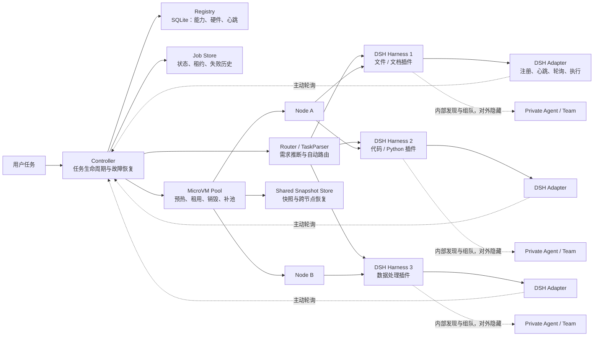

# 异构 Agent Router：DeepSeek Harness + MicroVM

> 当前版本：控制面原型 v0.2（DSH Harness、MicroVM Pool、动态注册与故障恢复）

这是一个面向异构 Agent Harness 的实验原型。当前主线聚焦于：用户提交自然语言任务，Controller 监听任务和状态，Router 自动选择合适的 DeepSeek Harness，MicroVM Pool 为 Harness 提供一次性隔离执行环境。

不同 Harness 使用同一个 DSH 运行时，但可以安装不同插件、声明不同工具和能力。Harness 内部如何发现 Agent、是否组建 Agent Team 以及如何协作，对全局 Router 和用户都是隐藏的。

## 当前结构



主目录只保留当前 DSH + MicroVM 主线。Mac/iPhone 是早期概念验证，已单独放入 [`archive/early_mac_iphone/`](archive/early_mac_iphone/)，实验过程见 [`reports/early_mac_iphone_experiment.md`](reports/early_mac_iphone_experiment.md)。

新的分层架构图见 [`docs/architecture_v2.md`](docs/architecture_v2.md)，其中分别展示控制面、执行面、隔离层和故障恢复路径。

## 核心流程

```text
POST /tasks
  → TaskParser 推断能力、工具、平台和资源需求
  → Router 读取 Registry，过滤不满足硬约束的 Harness
  → Controller 创建任务租约并从 MicroVM Pool 租用沙箱
  → DSH Adapter 轮询任务，在 MicroVM 内运行 DSH
  → Harness 自己发现 Agent / Agent Team 并完成内部协作
  → 回传统一结果
  → Controller 销毁任务 MicroVM，并补充预热池
```

用户不能在任务请求中指定 `harness_id`、`selected_unit` 或 `agent_id`。执行单元由 Router 根据任务需求、硬件、工具、负载和在线状态自动选择。

## 主要文件

| 文件 | 作用 |
|---|---|
| `controller.py` | Controller、任务 API、注册 API、心跳监视和故障恢复 |
| `router.py` | TaskParser、硬约束过滤和执行单元评分 |
| `registry.py` | SQLite Registry 和 Job Store |
| `microvm_pool.py` | MicroVM 预热、租用、销毁、补池和快照语义 |
| `microvm_nodes.json` | 逻辑节点、资源容量和运行时版本配置 |
| `dsh_agent.py` | DSH Harness 的注册、心跳、轮询和执行适配器 |
| `execution_units_dsh.json` | DSH Harness 能力、插件和 MicroVM Profile |
| `test_router.py` | 路由和需求解析测试 |
| `test_reliability.py` | 心跳、掉线、租约和重试测试 |
| `test_microvm_pool.py` | MicroVM 池、节点和快照测试 |
| `test_execution_units.json` | 测试专用的最小执行单元配置 |
| `archive/early_mac_iphone/` | 早期 Mac/iPhone 原型归档 |
| `reports/early_mac_iphone_experiment.md` | 早期实验报告 |

运行后生成的 `registry.db`、令牌、日志和 MicroVM 快照不会提交到 Git。

## 本地 / ECS 启动

### 1. 准备配置

当前配置中的三个执行单元都是统一的 DeepSeek Harness，只通过插件和能力产生差异：

```text
dsh_harness_01 → 文件、文档、Python
dsh_harness_02 → Shell、Python、代码构建
dsh_harness_03 → 数据处理、结构化抽取、Python
```

在 ECS 项目目录中：

```bash
cd /opt/heterogeneous-agents
export REGISTRY_TOKEN="$(cat /root/registry_token)"
```

### 2. 启动 Controller

```bash
python3 -u controller.py \
  --host 0.0.0.0 \
  --port 8081 \
  --registry execution_units_dsh.json \
  --database registry.db \
  --registry-token "$REGISTRY_TOKEN" \
  --microvm-pool-size 3 \
  --microvm-max-total 8 \
  --microvm-nodes microvm_nodes.json \
  --microvm-snapshot-dir /opt/heterogeneous-agents/microvm_snapshots
```

检查服务：

```bash
curl http://127.0.0.1:8081/health
curl -H "X-Registry-Token: $REGISTRY_TOKEN" \
  http://127.0.0.1:8081/registry/units
curl -H "X-Registry-Token: $REGISTRY_TOKEN" \
  http://127.0.0.1:8081/microvms
```

### 3. 启动 DSH Adapter

每个 Harness 应在自己的 MicroVM 中运行一个 Adapter。下面是文件/文档 Harness 的示例：

```bash
python3 dsh_agent.py \
  --controller-url http://CONTROLLER_IP:8081 \
  --registry-token "$REGISTRY_TOKEN" \
  --unit-id dsh_harness_01 \
  --profile headless \
  --capability local_file_access \
  --capability document_generation \
  --capability python \
  --tool dsh \
  --tool python \
  --plugin file \
  --plugin document \
  --workspace /workspace
```

Adapter 使用 DSH 官方 headless 调用形式：

```bash
dsh --profile headless "任务描述"
```

如果要模拟三个 Harness，可以分别启动三个 Adapter，并使用各自的 `--unit-id`、能力和插件参数。当前 `microvm_pool.py` 默认是 `MockMicroVMBackend`，用于先验证控制面，不会创建真实 KVM 虚拟机。

## 自动路由示例

任务只填写描述，不填写执行单元：

```bash
curl -X POST http://127.0.0.1:8081/tasks \
  -H 'Content-Type: application/json' \
  -d '{
    "task_id": "dsh-file-001",
    "description": "读取输入文件并生成一份报告",
    "input_path": "/workspace/input.txt"
  }'
```

Controller 返回 `job_id` 和 Router 的选择结果。查询任务：

```bash
curl http://127.0.0.1:8081/tasks/<job_id>
```

执行单元也可以运行期间动态注册：

```bash
curl -X POST http://127.0.0.1:8081/registry/register \
  -H 'Content-Type: application/json' \
  -H "X-Registry-Token: $REGISTRY_TOKEN" \
  -d '{
    "unit_id": "new_dsh_harness_01",
    "unit_type": "harness",
    "platforms": ["linux"],
    "capabilities": ["python", "parallel_compute"],
    "tools": ["dsh", "python"],
    "state": "idle",
    "load": 0.0,
    "metadata": {
      "harness_type": "deepseek",
      "sandbox": {"type": "microvm", "profile": "dsh-linux"},
      "hardware": {"architecture": "x86_64", "cpu_cores": 8, "memory_gb": 16, "gpu": false}
    },
    "heartbeat_required": true
  }'
```

## MicroVM Pool 语义

池采用任务级一次性沙箱：

```text
启动 Controller → 预热 3 个 READY MicroVM
任务选中 Harness → 租用 1 个 MicroVM
租用后立即创建新 MicroVM 补足 READY 余额
任务成功或失败 → 销毁本次任务 MicroVM
```

任务沙箱不归还，避免文件、进程、凭证和网络状态泄漏。池还支持以下控制面语义：

- 根据节点状态、CPU、内存和运行时版本选择节点；
- 隔离或排空节点，阻止新任务进入故障节点；
- 将 pause 快照写入共享目录，并在兼容节点恢复；
- 通过运行时版本检查保证旧快照不会被不兼容组件恢复。

`microvm_nodes.json` 中的 Node A / Node B 目前是同一台 ECS 上的逻辑节点，只能验证调度和状态语义，不能作为多物理机性能结果。真实跨主机恢复还需要接入 KVM、Firecracker 或 CubeSandbox，以及 S3/MinIO 等共享存储。

节点运维接口示例：

```bash
curl -H "X-Registry-Token: $REGISTRY_TOKEN" \
  http://127.0.0.1:8081/ops/nodes

curl -X POST -H "X-Registry-Token: $REGISTRY_TOKEN" \
  http://127.0.0.1:8081/ops/nodes/node-ecs-01/isolate

curl -X POST -H "X-Registry-Token: $REGISTRY_TOKEN" \
  http://127.0.0.1:8081/ops/nodes/node-ecs-01/restore
```

## 掉线与恢复

Controller 保存每次分配的 `lease_id`、`attempt` 和失败历史：

```text
Harness 停止心跳
  → Controller 标记 offline
  → 任务进入 retry_wait
  → Router 排除故障 Harness
  → 重新选择在线 Harness
  → 创建新的租约和 MicroVM
```

旧 Harness 恢复后提交旧租约结果时，Controller 会拒绝该结果，不能覆盖新 attempt。

## 测试

```bash
python3 -m unittest -v \
  test_router.py \
  test_reliability.py \
  test_microvm_pool.py
```

测试覆盖任务需求解析、硬约束路由、动态注册、心跳与掉线、任务重试、旧租约拒绝、Controller 重启恢复、MicroVM 预热/销毁/补池以及逻辑跨节点快照恢复。

## 研究路线

当前工程顺序为：

1. 用 Mock Backend 完成 Router、Controller、Registry 和 MicroVM Pool 的协调验证；
2. 在 ECS 上运行统一 DSH Harness，并用插件制造能力差异；
3. 接入真实 MicroVM Backend 和共享快照存储；
4. 引入 World Model，预测任务需求、Harness 成功率、延迟和资源状态；
5. 在多节点和故障注入场景下进行正式对比实验。

## 当前版本边界

当前版本已经可以在本地或 ECS 上验证 Router、Controller、Registry 和 MicroVM Pool 的协调关系，但 MicroVM 仍由 Mock Backend 表示，DSH Adapter 也需要单独启动。真实 KVM/CubeSandbox 接入、共享对象存储和 World Model 预测属于后续实验阶段。
