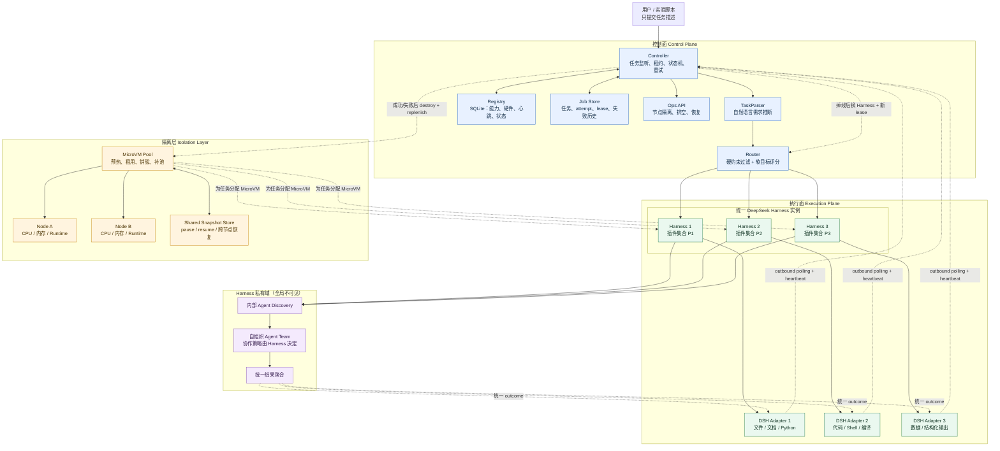
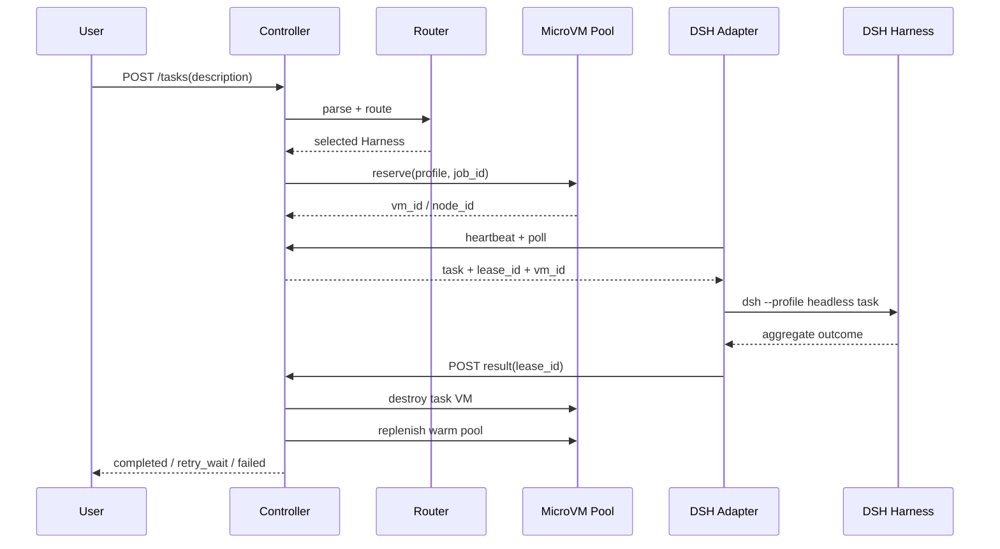

# 项目架构图 v2

这张图把系统按“控制面、执行面、隔离层、恢复路径”重新整理。全局 Router 只选择 Harness，不直接接触 Harness 内部的 Agent 或 Agent Team。

## 一次任务的生命周期

## 设计要点

| 层 | 只负责什么 | 不负责什么 |
|---|---|---|
| Controller | 任务状态、租约、心跳、重试和恢复 | 不决定 Harness 内部如何协作 |
| Router | 根据需求和注册表选择 Harness | 不接受用户强制指定 Agent |
| Registry | 保存能力、硬件、负载和在线状态 | 不执行任务 |
| DSH Harness | 插件调用、内部 Agent 发现、自组织 Team | 不直接修改全局路由结果 |
| MicroVM Pool | 隔离环境生命周期和节点资源 | 不理解任务语义 |

当前图中的 Node A / Node B 可以是同一台 ECS 上的逻辑节点；只有接入真实 KVM、MicroVM Backend 和共享存储后，才具备跨物理节点运行的实验含义。
