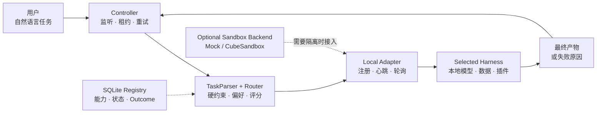
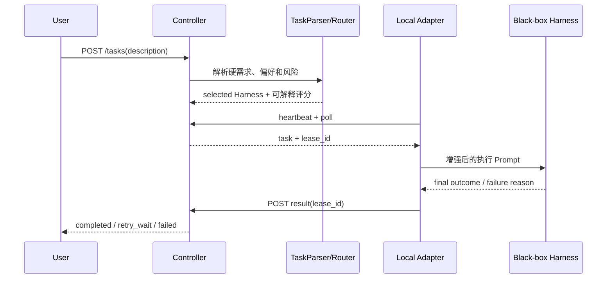

# FedHarness 本地架构

主执行链路完全运行在用户电脑上。全局 Router 只选择黑箱 Harness，不读取 Harness 内部的 Agent、轨迹、模型或本地数据。

## 本地任务生命周期

## 设计边界

| 层 | 负责 | 不负责 |
|---|---|---|
| Controller | 任务状态、租约、心跳、重试和准入 | 不观察 Harness 内部协作 |
| TaskParser | 将自然语言转换为约束、偏好和目标 | 不指定 Harness |
| Router | 过滤并选择 Harness | 不选择内部 Agent |
| Registry | 保存能力、状态和任务级 Outcome | 不保存思维链或内部 Trace |
| Adapter | 协议翻译、轮询和结果回传 | 不决定全局路由 |
| Harness | 使用本地硬件、模型、数据和 Agent Team 执行 | 不必公开内部结构 |
| Sandbox Backend | 可选的执行隔离 | 不参与任务语义判断 |

默认 `local_runtime.py` 使用本地进程和独立工作目录。CubeSandbox 仅在需要硬件隔离或云端扩展时作为插件接入，不是算法实验的必要条件。
