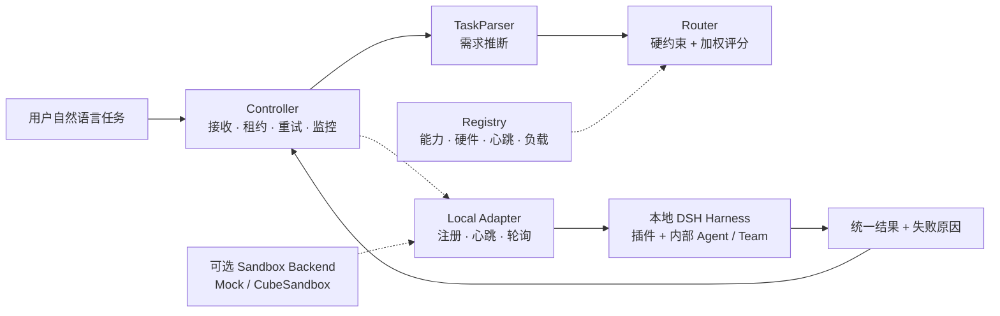

# 异构多 Agent 系统阶段性调研报告

> 版本：Phase 1 / Local FedHarness
> 更新时间：2026 年 9 月 14 日

## 摘要

本项目研究一个面向动态异构 Agent 网络的任务调度系统。用户只提交自然语言任务，系统根据任务需求、Harness 能力、硬件、负载和在线状态自动选择执行 Harness；Harness 内部可以自行发现 Agent、组建 Agent Team 并决定协作方式，全局 Controller 不干预其内部流程。

当前系统已经完成从 Controller、Router、Registry 到本地 DSH Adapter 的基本闭环，并提供不依赖 ECS、Docker、KVM 或 CubeSandbox 的一键本地运行方式。当前路由器仍然是规则和加权评分基线，尚未接入世界模型或 Monte Carlo 搜索。新 Harness 后台准入、掉线重试、任务级结果记录和黑箱边界已经成为下一阶段预测式调度的工程基础。此前 ECS + CubeSandbox 实验保留为可选隔离后端的历史验证，不再是本研究的运行前提。

## 1. 研究背景

传统 Agent 调度通常假设候选 Agent 的能力和运行状态相对稳定。但在实际环境中，不同 Agent 可能运行在不同的操作系统、硬件、容器或 MicroVM 中，且会出现：

- Agent 具有不同的工具、插件和硬件能力；
- CPU、内存、GPU、网络和本地文件等资源状态不断变化；
- Agent 可能延迟、掉线、超时或返回质量不稳定的结果；
- Harness 可能在运行过程中发现新的内部 Agent；
- Controller 对新 Agent 的真实能力和可靠性一无所知；
- 立即使用新 Agent 会带来探索成本和用户等待时间。

因此，系统需要同时解决两个问题：

1. 当前任务应该交给哪个已知 Harness？
2. 对于新发现或状态不确定的 Agent，系统应该获取哪些信息，以及是否值得为此付出测试成本？

## 2. 当前研究问题

当前项目将全局调度单位定义为 Harness，而不是 Harness 内部的单个 Agent：

```text
用户任务 → 全局 Router → Harness → 内部 Agent / Agent Team
```
方案描述：

在 多个Harness 动态加入、性能未知、状态变化且探测需要付出时间与计算成本的环境中，系统如何联合决定“测试谁、测试什么、何时停止测试，以及把用户任务交给谁”，从而优化成功率、延迟、成本和鲁棒性？

核心研究问题是：
1
> 在 Harness 内部结构不可见、Agent 状态动态变化、新 Agent 持续加入且执行可能失败的环境中，如何以较低的探索成本选择更可能成功的 Harness，并在执行失败时快速恢复？

后续世界模型还需要进一步回答：

> 当前任务下，哪些 Harness 信息对于调度最重要？下一步应该观察或测试哪个 Agent，才能最大化信息价值？

## 3. 系统架构



### 3.1 Controller

Controller 是控制面，负责：

- 接收任务请求；
- 调用 TaskParser 和 Router；
- 创建任务租约并分发给本地 Harness；
- 通过 Adapter 轮询分发任务；
- 监控 Harness 心跳；
- 处理超时、掉线、失败重试和重新路由；
- 在启用沙箱后管理任务级创建、销毁与补池；
- 管理后台 Canary 和新 Harness 准入状态。

Controller 不决定 Harness 内部 Agent 如何分工，也不把内部 Agent 暴露给全局 Router。

### 3.2 Registry

Registry 当前使用 SQLite，记录：

- Harness ID 和类型；
- 平台、能力和工具；
- 硬件信息；
- 当前状态和负载；
- 心跳要求与最近在线信息；
- 后台测试次数、成功次数、失败原因和置信度。

未来可以将 SQLite 替换为 PostgreSQL，并使用 Redis 保存心跳和短期状态。

### 3.3 DSH Harness 与 Adapter

当前本地实验使用 DSH 或零依赖 Mock Harness 作为运行接口。Adapter 将 Harness 注册到 Controller，并负责：

- 注册与心跳；
- 前台任务轮询；
- 后台 Probe 轮询；
- 在各自独立的本地工作目录中调用 DSH；
- 在可选沙箱模式下连接 Controller 租用的 MicroVM；
- 回传统一结果、延迟、退出码和失败类型。

Harness 内部可以只有一个 Agent，也可以包含多个 Agent 或自组织 Agent Team。全局只看到 Harness 的聚合能力。

## 4. 当前任务分派方法

当前没有世界模型、Monte Carlo 搜索或在线学习。现有 Router 是一个确定性的基线方法：

```text
自然语言描述
    ↓
关键词规则解析
    ↓
硬约束过滤
    ↓
静态性能字段 + 实时负载加权评分
    ↓
选择最高分 Harness
```

### 4.1 TaskParser

TaskParser 使用与公开路由政策 Prompt 对齐的确定性规则，从任务描述中推断：

- `required_capabilities`；
- `required_tools`；
- `allowed_platforms`；
- 是否需要 GPU；
- 是否需要移动端；
- 网络、隐私、风险和并行性；
- 延迟、成本、质量与成功率权重；
- 否定表达、冲突警告和每项推断原因。

例如“读取本地文件并生成报告”会推断出 `local_file_access` 和 `document_generation`；“使用手机摄像头拍照”会推断出 `mobile`、`camera` 和 `ios` 平台。

### 4.2 硬约束过滤

Router 首先排除：

- `offline` 或 `testing` 的 Harness；
- 后台专用 Harness；
- 缺少所需 capability 的 Harness；
- 缺少所需 tool 的 Harness；
- 平台不兼容的 Harness；
- 不满足 GPU 或移动端要求的 Harness。

### 4.3 加权评分

通过硬约束后，Router 使用默认权重：

| 指标 | 权重 |
|---|---:|
| 配置成功率 | 0.35 |
| 质量评分 | 0.30 |
| 延迟 | 0.15 |
| 成本 | 0.10 |
| 当前负载 | 0.10 |

目前 `success_rate`、`quality_score` 和 `avg_latency_ms` 主要来自注册配置，任务完成后尚未自动更新为在线统计。因此当前方法应被称为“规则和静态统计驱动的路由基线”，而不是世界模型或强化学习调度器。

## 5. 新 Harness 后台准入

为避免未知 Harness 直接影响用户任务，系统采用前后台隔离：

```text
新 Harness 注册
    ↓
testing / background-only
    ↓
后台 Canary Probe
    ↓
分配本地 Harness 工作目录
    ↓
Adapter 使用 Mock 或本机 DSH 执行
    ↓
成功：idle / foreground
失败：重试或 degraded
```

### 5.1 当前准入规则

- 新 Harness 默认进入 `testing`；
- 后台 Probe 与用户任务队列分离；
- 默认一次 Canary 成功即可进入前台；
- 失败最多重试指定次数；
- 达到失败上限后标记为 `degraded`；
- 重新连接时，失败 Harness 可以重新进入测试，而不会绕过准入流程；
- 只有进入前台后，Router 才可以选择它。

### 5.2 Harness 发现内部 Agent

Harness 可以向 Controller 报告新发现的内部 Agent。新 Agent 不会成为全局 Registry 的独立路由单元，而是保存为父 Harness 的候选信息：

```text
Harness 发现 Agent
    ↓
父 Harness 内部候选状态 testing
    ↓
后台 Canary / 合成 Probe / Shadow Task
    ↓
候选 eligible
    ↓
能力汇总到父 Harness
    ↓
Router 继续只选择父 Harness
```

这样既保留了 Harness 内部的自主性，又避免未经验证的 Agent 直接进入前台。

## 6. 本地执行与可选沙箱

默认实验直接在用户电脑上启动多个本地 Harness，每个 Harness 使用独立工作目录：

```text
python3 local_runtime.py --engine mock/host
    → 本地 Controller
    → 五个能力不同的 Harness 进程
    → 独立工作目录
    → 本地任务级结果与失败原因
```

`mock` 模式不需要 DSH 和模型凭证，用于功能回归与调度实验；`host` 模式调用本机 DSH，用于真实任务。两种模式都不依赖 ECS。它们提供进程与目录级隔离，但不构成处理不可信代码的硬件安全边界。

MicroVM Pool 和 CubeSandbox Backend 继续作为可选插件保留。启用后仍采用任务成功或失败后销毁、再补充全新预热实例的语义。

## 7. 历史 ECS + CubeSandbox 验证

### 7.1 环境

- Ubuntu 22.04；
- x86_64 ECS；
- PVM Host Kernel；
- `kvm_pvm` 内核模块；
- `/dev/kvm` 可用；
- CubeSandbox Control 面健康检查正常；
- Cube API：本机 `127.0.0.1:3000`；
- DSH 版本：`0.1.5-rc.1`；
- Node.js：`24.21.0`；
- npm：`11.19.0`；
- READY Template：已安装 DSH 的 CubeSandbox 模板。

### 7.2 已完成端到端验证

已经完成一次真实 ECS 执行：

1. 用户提交自然语言 Python 测试任务；
2. Controller 自动选择 `dsh_harness_01`；
3. MicroVM Pool 租用 CubeSandbox 实例；
4. DSH Adapter 获得任务和 `microvm_id`；
5. DSH 在 MicroVM 内执行 Python `unittest`；
6. 4 个测试用例全部通过；
7. Controller 销毁任务 MicroVM；
8. MicroVM Pool 创建新的 READY 实例补充余额。

该结果证明当前系统已经具备“任务自动路由—隔离执行—销毁—补池”的完整工程闭环，但单次端到端成功不能替代正式性能实验。

### 7.3 当前 Harness 状态

当前配置包含三个已知 DSH Harness：

| Harness | 能力方向 | 当前用途 |
|---|---|---|
| `dsh_harness_01` | 文件、文档、Python | 已完成端到端验证 |
| `dsh_harness_02` | Shell、编译器、代码构建 | 已接入并可作为候选 |
| `dsh_harness_03` | 数据处理、结构化抽取 | 已接入并可作为候选 |

后续新增 Harness 可以使用不同的插件声明、工具集合、延迟、负载和故障概率模拟异构环境。

该历史结果用于证明可插拔隔离后端可行，但不作为后续算法实验必须依赖的基础设施。

## 8. 当前本地测试结果

本地测试已经覆盖：

- Router 硬约束和候选排序；
- 动态注册与掉线重试；
- 前后台队列隔离；
- 新 Harness 测试成功后进入前台；
- 后台 Probe 租用 MicroVM 并在完成后销毁补池；
- 失败 Harness 重新连接后重新进入测试；
- MicroVM 预热、租用、销毁、补池和逻辑跨节点快照；
- HTTP API 的任务轮询和 Harness 发现。
- 本地一键启动 Controller 与五个 Harness；
- 零依赖 Mock 端到端任务提交、自动路由和结果返回；
- DSH 黑箱执行 Prompt 与本机平台自动注册。

当前验证结果（2026 年 9 月 14 日）：

```text
Router / Local Runtime / Reliability / Sandbox 测试：24/24 通过
Controller HTTP 测试：2/2 通过
本地五 Harness 端到端 Smoke Test：通过
```

这些是功能回归测试，不是正式的性能或统计显著性实验。

## 9. 当前不足

### 9.1 没有结果预测

当前 Router 不会预测某个 Harness 在未来状态下的成功率、尾部延迟或掉线概率，只会读取当前注册字段和心跳负载。

### 9.2 没有自动更新性能统计

真实任务结果尚未系统地更新 `success_rate`、`quality_score` 和 `avg_latency_ms`。因此注册表中的性能值仍然更接近先验配置。

### 9.3 没有主动选择测试信息

当前后台测试由固定 Canary 触发，不会自动判断“测试 GPU、观察心跳或检查插件”哪个最有价值。

### 9.4 没有 Monte Carlo 或世界模型

当前没有对不同调度方案进行未来状态模拟，也没有根据不确定性在探索新 Agent 与利用已知 Agent 之间进行优化。

### 9.5 本地实验规模仍有限

单机多进程可以验证调度、探索和故障恢复算法，但不能直接证明跨物理机通信性能或硬件隔离强度。

## 10. 下一阶段研究方向

### 10.1 Monte Carlo 过渡方案

第一步不直接训练复杂世界模型，而是在 Router 硬约束过滤之后加入浅层 Monte Carlo Rollout：

```text
候选 Harness
    ↓
采样成功率、延迟、掉线和 MicroVM 成本
    ↓
模拟多种未来结果
    ↓
计算期望效用和风险
    ↓
选择 Harness 或主备 Harness
```

它可以作为世界模型的过渡实现，也可以作为论文中的强基线。

### 10.2 世界模型

后续将使用任务特征、Harness 可观测状态和任务级执行结果训练预测模型。每个 Harness 都是黑箱，不要求上传内部 Agent、思维链、工具调用轨迹、本地模型参数或私有数据。模型预测：

- 任务成功概率；
- 延迟和尾部延迟；
- 资源消耗；
- 失败类型；
- 新 Agent 的准入可信度；
- 是否值得启用副 Agent Team。

### 10.3 主动信息获取

世界模型不仅选择 Agent，还应选择下一步获取什么信息：

```text
当前不确定性
    ↓
候选信息查询 / 测试
    ↓
估计信息价值 - 测试成本
    ↓
选择最值得的测试
    ↓
更新预测模型和候选池
```

这可以形式化为 Value of Information，并与后台 Canary、合成 Probe 和 Shadow Task 结合。

### 10.4 主备 Agent Team

对于高风险任务，世界模型选择主 Team 和副 Team，通过任务版本、租约、幂等键、一致性哈希和结果去重实现快速接管。副 Team 不默认复制所有任务，而是根据失败风险和任务价值选择性启用。

## 11. 建议实验路线

1. 在本机完成五个 DSH Harness 的稳定接入；
2. 对每个 Harness 注入可控延迟、负载、掉线和成功率；
3. 建立不含内部轨迹的任务级 Outcome Store 和标准化 Probe Suite；
4. 对比静态能力路由、负载感知路由、历史统计路由和 Monte Carlo Rollout；
5. 比较立即准入、随机 Canary、合成 Probe 和组合准入；
6. 训练离线成功率、延迟和风险预测模型；
7. 加入主动信息获取策略；
8. 最后加入选择性主备 Team 和故障接管实验。

## 12. 阶段性结论

当前项目已经从早期 Mac/iPhone 和 ECS/CubeSandbox 验证发展为一个可以在普通用户电脑上运行的黑箱异构 Harness 调度原型。系统目前最重要的成果不是已经实现世界模型，而是建立了一个不依赖云基础设施、能够承载后续研究的执行闭环：

```text
自动需求解析
→ Harness 选择
→ 本地黑箱 Harness 执行
→ 前后台准入
→ 心跳与租约
→ 失败重试
→ 任务级结果与失败报告
```

后续研究应以当前确定性 Router 作为 Baseline，逐步引入 Monte Carlo、世界模型、主动信息获取和主备容错，并通过严格对比实验验证每个模块的实际收益。
